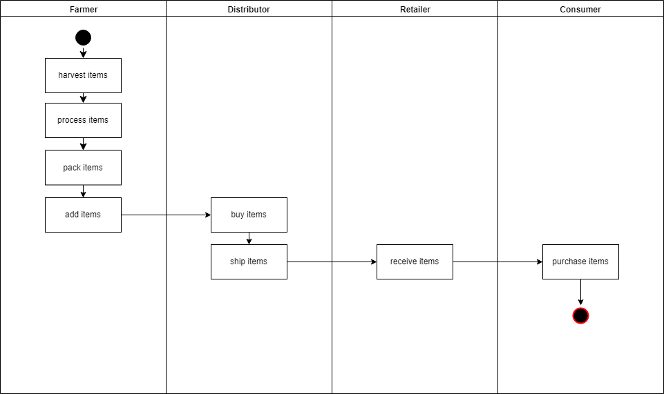

# Blockchain Developer Nanodegree project 3 (Supply chain )
This repository containts an Ethereum DApp that demonstrates a Supply Chain flow between a Seller and Buyer. The user story is similar to any commonly used supply chain process. A Seller can add items to the inventory system stored in the blockchain. A Buyer can purchase such items from the inventory system. Additionally a Seler can mark an item as Shipped, and similarly a Buyer can mark an item as Received.

## Project write-up - UML

### Activity


### Sequence


### State


### Classes (Data Model)


## Project write-up - Libraries
The `Roles` library was used by different access control contracts for easy add and remove in the supply chain 
`truffle-hd-wallet-provider` to sign transactions for addresses.

## IPFS
IPFS is not used in this project

## Program Versions numbers
Node: v10.15.3
Solidity: v0.4.24
Truffle: v5.0.25
Web3.js: v1.0.0-beta37 

## Contract address on the Rinkeby test network (Etherscan):
https://rinkeby.etherscan.io/tx/0x4b58fb1c0a0eb38a267741d2fbf170e1ae4403e37f4c573772358a1e333c61b8

## Transaction ID and contract address / details
Starting migrations...
======================
> Network name:    'rinkeby'
> Network id:      4
> Block gas limit: 0x989680


1_initial_migration.js
======================

   Replacing 'Migrations'
   ----------------------
   > transaction hash:    0x1f749f74c609ede6d58dac63762482e5bbc6a0eabeb389d689178fa73aaa3f7a
   > Blocks: 0            Seconds: 5
   > contract address:    0x8c54E776479d39D633B5EBCe4bE1659C7a2170E1
   > block number:        6480065
   > block timestamp:     1589356415
   > account:             0x7554744F910b0E8925f108a40201eE25B4823ab1
   > balance:             16.433272777
   > gas used:            238594
   > gas price:           20 gwei
   > value sent:          0 ETH
   > total cost:          0.00477188 ETH

   Pausing for 2 confirmations...
   ------------------------------
   > confirmation number: 1 (block: 6480066)
   > confirmation number: 2 (block: 6480067)

   > Saving migration to chain.
   > Saving artifacts
   -------------------------------------
   > Total cost:          0.00477188 ETH


2_deploy_contracts.js
=====================

   Replacing 'FarmerRole'
   ----------------------
   > transaction hash:    0xc57f4e3cd42924ff857645ef31b75fc0884a35b96ddb6910ee80412626bf1ceb
   > Blocks: 0            Seconds: 9
   > contract address:    0x2F9380720dEAF6A4Cf9C2886116874d14aA452Cb
   > block number:        6480069
   > block timestamp:     1589356475
   > account:             0x7554744F910b0E8925f108a40201eE25B4823ab1
   > balance:             16.423405417
   > gas used:            451020
   > gas price:           20 gwei
   > value sent:          0 ETH
   > total cost:          0.0090204 ETH

   Pausing for 2 confirmations...
   ------------------------------
   > confirmation number: 1 (block: 6480070)
   > confirmation number: 2 (block: 6480071)

   Replacing 'DistributorRole'
   ---------------------------
   > transaction hash:    0xe4536865c4f062b2a82424e71e2094d7d6753eef95d7a446022d4c6e4f67ac6d
   > Blocks: 0            Seconds: 5
   > contract address:    0x1d0e847F0FB491Ce5526503b0c0D8B165A9A3E97
   > block number:        6480072
   > block timestamp:     1589356520
   > account:             0x7554744F910b0E8925f108a40201eE25B4823ab1
   > balance:             16.414383577
   > gas used:            451092
   > gas price:           20 gwei
   > value sent:          0 ETH
   > total cost:          0.00902184 ETH

   Pausing for 2 confirmations...
   ------------------------------
   > confirmation number: 1 (block: 6480073)
   > confirmation number: 2 (block: 6480074)

   Replacing 'RetailerRole'
   ------------------------
   > transaction hash:    0x632d9c5db63dc2578e0f761cb2b47ba9c341db3de7ebe6cac51f36d715674983
   > Blocks: 1            Seconds: 9
   > contract address:    0x796230482AA41Ef089F2DA0b20889745894ac3D7
   > block number:        6480075
   > block timestamp:     1589356565
   > account:             0x7554744F910b0E8925f108a40201eE25B4823ab1
   > balance:             16.405361977
   > gas used:            451080
   > gas price:           20 gwei
   > value sent:          0 ETH
   > total cost:          0.0090216 ETH

   Pausing for 2 confirmations...
   ------------------------------
   > confirmation number: 1 (block: 6480076)
   > confirmation number: 2 (block: 6480077)

   Replacing 'ConsumerRole'
   ------------------------
   > transaction hash:    0x37faf4d45ccc085ebe83d981206664b2665c54811bb120391b1b37e77199e567
   > Blocks: 0            Seconds: 5
   > contract address:    0x3b247ad549F455B42eA137399B35f1C1e3a4c9ce
   > block number:        6480078
   > block timestamp:     1589356610
   > account:             0x7554744F910b0E8925f108a40201eE25B4823ab1
   > balance:             16.396340857
   > gas used:            451056
   > gas price:           20 gwei
   > value sent:          0 ETH
   > total cost:          0.00902112 ETH

   Pausing for 2 confirmations...
   ------------------------------
   > confirmation number: 1 (block: 6480079)
   > confirmation number: 2 (block: 6480080)

   Replacing 'SupplyChain'
   -----------------------
   > transaction hash:    0x4b58fb1c0a0eb38a267741d2fbf170e1ae4403e37f4c573772358a1e333c61b8
   > Blocks: 0            Seconds: 5
   > contract address:    0x89b218Aca6417B3cfe70ef511264225f79e26ffb
   > block number:        6480081
   > block timestamp:     1589356655
   > account:             0x7554744F910b0E8925f108a40201eE25B4823ab1
   > balance:             16.330423377
   > gas used:            3295874
   > gas price:           20 gwei
   > value sent:          0 ETH
   > total cost:          0.06591748 ETH

   Pausing for 2 confirmations...
   ------------------------------
   > confirmation number: 1 (block: 6480082)
   > confirmation number: 2 (block: 6480083)

   > Saving migration to chain.
   > Saving artifacts
   -------------------------------------
   > Total cost:          0.10200244 ETH


Summary
=======
> Total deployments:   6
> Final cost:          0.10677432 ETH


 

## Getting Started

These instructions will get you a copy of the project up and running on your local machine for development and testing purposes. See deployment for notes on how to deploy the project on a live system.

### Prerequisites

Please make sure you've already installed ganache-cli, Truffle and enabled MetaMask extension in your browser.

```
Give examples (to be clarified)
```

### Installing

A step by step series of examples that tell you have to get a development env running

Clone this repository:

```
git clone https://github.com/udacity/nd1309/tree/master/course-5/project-6
```

Change directory to ```project-6``` folder and install all requisite npm packages (as listed in ```package.json```):

```
cd project-6
npm install
```

Launch Ganache:

```
ganache-cli -m "spirit supply whale amount human item harsh scare congress discover talent hamster"
```

Your terminal should look something like this:


In a separate terminal window, Compile smart contracts:

```
truffle compile
```

Your terminal should look something like this:


This will create the smart contract artifacts in folder ```build\contracts```.

Migrate smart contracts to the locally running blockchain, ganache-cli:

```
truffle migrate
```

Your terminal should look something like this:


Test smart contracts:

```
truffle test
```

All 10 tests should pass.


In a separate terminal window, launch the DApp:

```
npm run dev
```

## Built With

* [Ethereum](https://www.ethereum.org/) - Ethereum is a decentralized platform that runs smart contracts
* [IPFS](https://ipfs.io/) - IPFS is the Distributed Web | A peer-to-peer hypermedia protocol
to make the web faster, safer, and more open.
* [Truffle Framework](http://truffleframework.com/) - Truffle is the most popular development framework for Ethereum with a mission to make your life a whole lot easier.


## Authors

See also the list of [contributors](https://github.com/your/project/contributors.md) who participated in this project.

## Acknowledgments

* Solidity
* Ganache-cli
* Truffle
* IPFS


